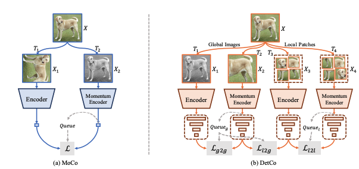
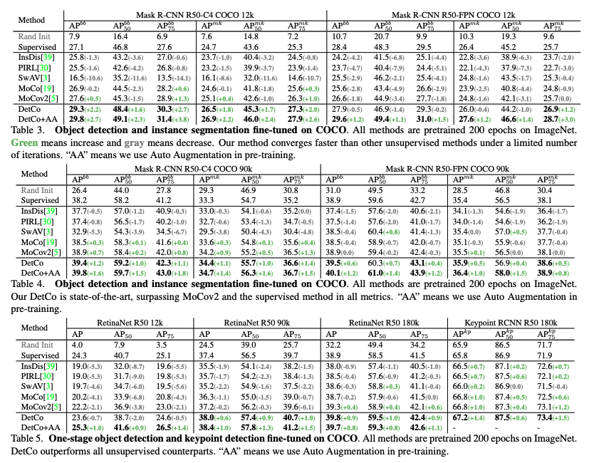
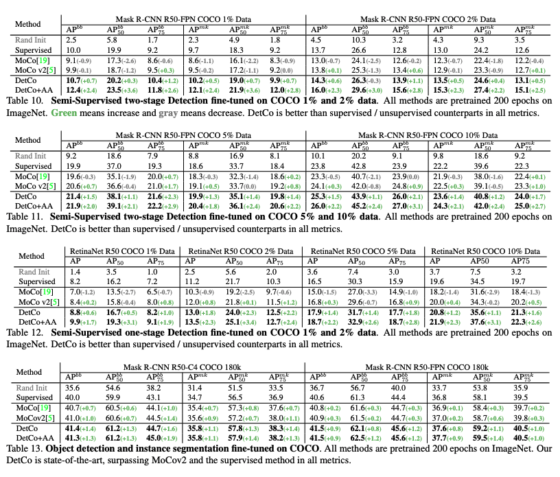
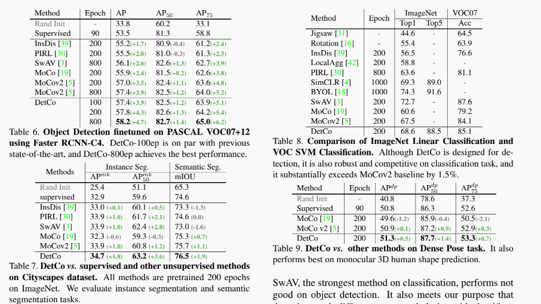
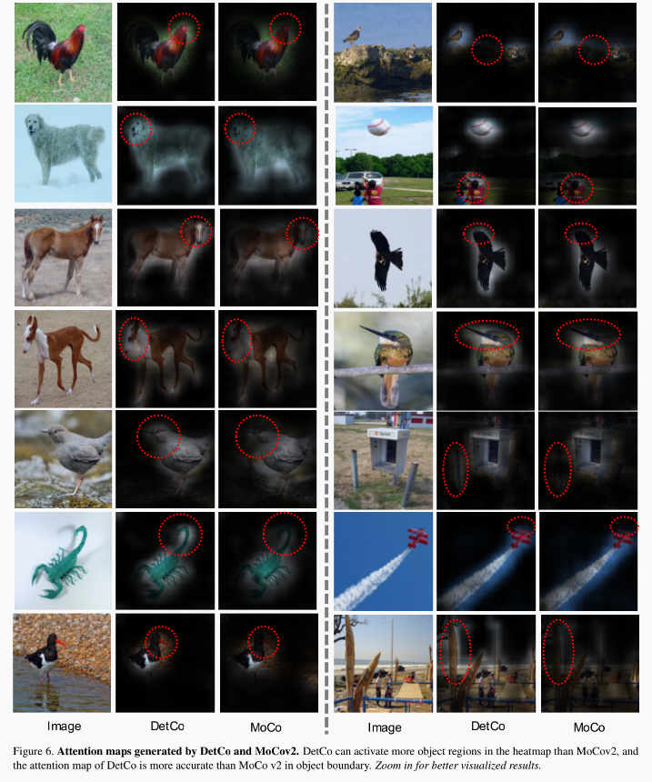

# DetCo: Unsupervised Contrastive Learning for Object Detection
[arxiv link](https://arxiv.org/abs/2102.04803)

## News
- Pretrained weights has been released. 


## Highlights

- State-of-the-art transfer performance on dense prediction tasks.
- Improving  1.6/1.2/1.0 AP than supervised ImageNet pretrain on Mask RCNN-C4/FPN/RetinaNet with COCO 1x schedule.
- Comprehensively improving most instance-level detection and semantic segmentation tasks.

## Pipeline



## Performances


-----



----



-----



-----


## Install
Same as [OpenSelfSup](https://github.com/open-mmlab/OpenSelfSup).

## Codes

### Pretext Task Pretrain

Coming Soon.

### Transfer to Downstream tasks

We provide training scripts on COCO, because the performance of COCO is more stable than VOC and Cityscapes.
See results in Table 3-5 and Table 13.

We provide Mask RCNN-C4, Mask RCNN-FPN and RetinaNet with 12k, 90k and 180k iterations.

First, you need to download model(.pkl) to `benchmarks/detection/pths`, and convert pretrain model to detectron2_version. See [this script](benchmarks/detection/convert-pretrain-to-detectron2.py).

Second, start training and testing.
```
sh tools_local/dist_test_coco.sh $PTH $WORK_DIR
```

For example:
```
sh tools_local/dist_test_coco.sh benchmarks/detection/pths/detco_200ep_AA.pkl benchmarks/detection/work_dirs/detco_AA
```

## Download Models
DetCo-200ep: [[Google Drive]](https://drive.google.com/file/d/1w8cO8VyTUhyOY55nd-YbPxBXyJnhnDXR/view?usp=sharing), [[Baidu Drive]](https://pan.baidu.com/s/1ZMRCvi_RyI-X-gb9lukK7g) Fetch Code: okfp 
 
DetCo-200ep-AA: [[Google Drive]](https://drive.google.com/file/d/1CF8_G99uVNMsu28HDi04psBO2zzz3tXc/view?usp=sharing), [[Baidu Drive]](https://pan.baidu.com/s/18ilDo6crkgPDK-77LmKCGQ) Fetch Code: fg7h

## Citations
Please consider citing our paper in your publications if the project helps your research. BibTeX reference is as follows.

```
@misc{xie2021detco,
      title={DetCo: Unsupervised Contrastive Learning for Object Detection}, 
      author={Enze Xie and Jian Ding and Wenhai Wang and Xiaohang Zhan and Hang Xu and Zhenguo Li and Ping Luo},
      year={2021},
      eprint={2102.04803},
      archivePrefix={arXiv},
      primaryClass={cs.CV}
}
```


## Acknowledges
We would like to thank Huawei AI Theory Group to support 200+ V100 GPUs for this research project without which this work would not be possible.

## License

For academic use, this project is licensed under the 2-clause BSD License - see the LICENSE file for details. For commercial use, please contact the authors. 